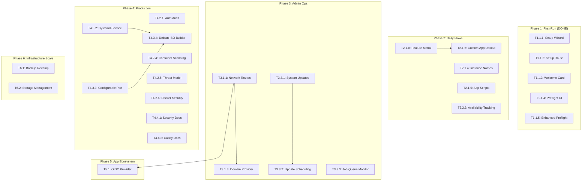

# LibreServ Development Roadmap

**Target Audience:** General users who shouldn't need a terminal
**Delivery Method:** Hardware with software pre-installed

This roadmap is organized by **user journey** so developers understand what matters most.

---

## Quick Navigation

- [Critical Path](#critical-path)
- [Phase 1: First-Run Experience](#phase-1-first-run-experience) — DONE
- [Phase 2: Daily User Flows](#phase-2-daily-user-flows) — IN PROGRESS
- [Phase 3: Admin Operations](#phase-3-admin-operations) — IN PROGRESS
- [Phase 4: Production Readiness](#phase-4-production-readiness) — IN PROGRESS
- [Phase 5: App Ecosystem](#phase-5-app-ecosystem) — PLANNED
- [Phase 6: Infrastructure Scale](#phase-6-infrastructure-scale) — PLANNED
- [Phase 7: Advanced Features](#phase-7-advanced-features) — PLANNED

---

## Critical Path

```
User receives hardware -> Powers on -> Opens browser ->
Sees Setup Wizard -> Creates admin account ->
Installs an app -> It works -> Creates backup -> Done
```

**If any step in this flow is broken, nothing else matters.**

### Must-Have Features (Priority Order)

| Priority | Feature | Why | Current State |
|----------|---------|-----|---------------|
| P0 | Setup Wizard | No terminal = must have GUI setup | Done |
| P0 | App Install Flow | Core value proposition | Done |
| P0 | Backup/Restore | "Actions should be reversible" | Done (basic) |
| P1 | HTTPS/Domain Setup | Production requirement | Backend done, no UI |
| P1 | Domain Provider Integration | Remote access requires domain | Not started |
| P1 | System Health Display | User confidence | Done |
| P2 | Network Routes UI | Manage app access | Not started |

---

## Phase 1: First-Run Experience

**Goal:** User powers on and completes setup without terminal

### T1.1.1. Setup Wizard Page

**Status:** Done
**File:** `server/frontend/src/pages/SetupPage.jsx`

- Welcome screen with plain-language intro
- Admin account creation (username, password, email)
- Preflight checks (Docker, DB, disk space, permissions)
- Auto-redirect to dashboard on completion

### T1.1.2. Setup Route

**Status:** Done
- Route `/setup` shows SetupPage
- SetupPage redirects to root if already configured

### T1.1.3. Welcome/Onboarding Component

**Status:** Done
**File:** `server/frontend/src/components/onboarding/WelcomeCard.jsx`

- Shows after first login only (localStorage)
- 3 quick action cards (Install App, Configure Settings, Read Docs)
- Dismissible with "Don't show again"

### T1.1.4. Preflight Checks UI

**Status:** Done

- Each check with pass/fail icon
- Disk space in human-readable format
- Warnings for optional things (SMTP)
- Retry button for failed checks
- Blocks setup if critical checks fail

### T1.1.5. Enhanced Preflight Permission Checks

**Status:** Done

- Detects root-owned/read-only directories
- Plain-language error messages
- Technical details logged server-side
- Checks grouped by category (system, storage, network)

---

## Phase 2: Daily User Flows

**Goal:** User can install apps, create backups, check status — all from web UI

### 2.1 App Installation

#### T2.1.0. App Feature Matrix Schema

**Status:** Done

- `AccessModel` types: `shared_account`, `integrated_users`, `external_auth`, `public`
- `FeatureSupport`, `UpdateBehavior`, `ResourceHints` types
- `GET /api/v1/catalog/{app_id}/features` endpoint

#### T2.1.1. App Install Wizard

**Status:** Done

- Multi-step wizard (Select -> Configure -> Install -> Done)
- Feature warnings based on access model
- Shared credentials input for shared_account apps
- Real-time install progress
- "Open App" button on success

#### T2.1.2. App Catalog Page

**Status:** Done

- Live API data from `/api/v1/catalog`
- Category grouping, search/filter
- "Installed" badge on already-installed apps

#### T2.1.3. App Uninstall with Confirmation

**Status:** Done

- Confirmation modal with typing requirement
- Shows what will be deleted (volumes, config)
- Progress indicator during uninstall
- Start/Stop/Restart buttons

#### T2.1.4. Custom App Instance Names

**Status:** Not started
**Effort:** 3h
**Dependencies:** None

Allow installing multiple instances of the same app, each with a custom name.

**Acceptance Criteria:**
- [ ] Install wizard allows naming each instance
- [ ] Instance name shown in app list and detail page
- [ ] Port conflicts detected and resolved automatically
- [ ] Each instance has independent config, volumes, and state

#### T2.1.5. Implement Remaining App Scripts

**Status:** Not started
**Effort:** 8h (total for all apps)
**Dependencies:** None

Implement missing lifecycle scripts (update, repair, backup, restore) for each builtin app. The install, start, and stop lifecycle operations already work — this task covers the remaining four operations.

**Apps needing scripts:**

| App | system-update | system-repair | system-backup | system-restore |
|-----|:---:|:---:|:---:|:---:|
| ConvertX | - | - | - | - |
| LibreChat | - | - | - | - |
| Nextcloud AIO | - | - | - | - |
| Ollama | - | - | - | - |
| SearXNG | - | - | - | - |

**Note:** This likely requires extensive headless interaction work for each app.

#### T2.1.6. Custom App Upload and URL Install

**Status:** Not started
**Effort:** 6h
**Dependencies:** T2.1.0

Allow users to install apps beyond the builtin catalog.

**User Journey:**
1. User clicks "Install Custom App" in catalog
2. Chooses: upload a `.tar.xz` package OR paste a URL
3. LibreServ validates the package against LibreServ App Format
4. Shows app metadata from `app.yaml`
5. Proceeds through normal install wizard

**Acceptance Criteria:**
- [ ] Upload `.tar.xz` containing `app.yaml` + `docker-compose.yml` + optional scripts
- [ ] Paste URL to `.tar.xz` (HTTP/HTTPS, git repo archive)
- [ ] Validate `app.yaml` schema (required fields, no malicious content)
- [ ] Validate `docker-compose.yml` (no privileged by default, no host network)
- [ ] Security scanning for shell scripts in package
- [ ] Size limits (configurable, default 50MB)
- [ ] Custom apps tagged as `AppTypeCustom` in database
- [ ] Custom apps appear in catalog with "Custom" badge
- [ ] Uninstall removes custom app files

**Backend API (to add):**
- `POST /api/v1/catalog/upload` — Upload custom app package
- `POST /api/v1/catalog/install-url` — Install from URL
- `GET /api/v1/catalog/custom` — List custom apps

### 2.2 Backup & Restore

#### T2.2.1. Backups Page

**Status:** Done
**File:** `server/frontend/src/pages/BackupsPage.jsx`

- List backups sorted by date (newest first)
- Create/restore/delete with progress indicators
- Cloud backup status display

#### T2.2.2. Backup Schedule UI

**Status:** Done
**File:** `server/frontend/src/components/backups/ScheduleForm.jsx`

- Preset schedules (Daily, Every 6h, Weekly)
- Custom cron support
- Retention policy (keep last N)
- Shows next scheduled run time

#### T2.2.3. Cloud Backup Integration

**Status:** Done

- Backblaze B2 and S3-compatible providers
- Credential encryption (AES-256-GCM)
- Auto-upload after backup creation when enabled
- "Test Connection" button

#### T2.2.4. Backup Download/Upload & Database Backup

**Status:** Done

- Download backup files from web UI
- Upload `.tar.gz` backup files with progress
- Unattached backups section (deleted apps + uploaded)
- Restore unattached backup to any installed app
- "Save DB" and "Upload & Restore DB" buttons

### 2.3 App Status & Monitoring

#### T2.3.1. App Detail Page (Enhanced)

**Status:** Done

- Resource usage (CPU, RAM, disk) from `/api/v1/apps/{id}/metrics`
- Health status icon
- Start/Stop/Restart with confirmation
- Link to app's web interface
- Installed version and available updates

#### T2.3.2. App Logs Viewer

**Status:** Done
**File:** `server/frontend/src/components/app/LogsViewer.jsx`

- Full-page log viewer with auto-scroll
- Pause/Resume scrolling
- Search/filter logs
- Download logs as text file
- Last 500 lines by default, load more on scroll

#### T2.3.3. Improve Availability Tracking

**Status:** Not started
**Effort:** 4h
**Dependencies:** None

Implement a global system to track uptime and availability of apps and the server itself.

**Acceptance Criteria:**
- [ ] Per-app uptime/downtime tracking (already partially in `InstalledApp`)
- [ ] Server-level uptime tracking
- [ ] Availability percentage calculation (rolling 7d/30d)
- [ ] Dashboard widget showing overall system health
- [ ] Historical availability data persisted in database

---

## Phase 3: Admin Operations

**Goal:** Admin can manage users, domains, and system from web UI

### 3.1 Network & HTTPS

#### T3.1.1. Network Routes Page

**Status:** Needs polish
**Effort:** 3h
**Dependencies:** None

**User Journey:**
1. Admin clicks "Network" -> "Routes"
2. Sees all domains pointing to apps
3. Adds new domain: "blog.example.com" -> "wordpress:8080"
4. System requests HTTPS certificate automatically

**Backend API (exists):**
- `GET /api/v1/network/routes` — List routes
- `POST /api/v1/network/routes` — Create route
- `DELETE /api/v1/network/routes/{id}` — Delete route

**Acceptance Criteria:**
- [ ] List routes with domain, target, HTTPS status
- [ ] Add route form (domain, backend address)
- [ ] Test connectivity before saving
- [ ] Delete with confirmation
- [ ] Show Caddy status

#### T3.1.3. Domain Provider Integration

**Status:** Not started
**Effort:** 4h
**Dependencies:** T3.1.1

**User Journey:**
1. User goes to Network -> Domain Setup
2. Sees options: "Use existing domain", "Use free subdomain", or "Manual"
3. For existing domain: enters domain + provider credentials
4. System configures DNS automatically
5. System sets up Dynamic DNS (for home connections)
6. HTTPS certificate requested automatically

**Recommended approach:** Manual setup guide first, then DuckDNS (free), then Cloudflare/Namecheap APIs.

**Acceptance Criteria:**
- [ ] Domain setup wizard UI
- [ ] Provider selection (DuckDNS, Cloudflare, Namecheap, Manual)
- [ ] Credential input form with validation
- [ ] "Test DNS Configuration" button
- [ ] Dynamic DNS update service
- [ ] Auto-detect public IP
- [ ] Plain-language setup guide for manual option

**Backend API (to add):**
- `GET /api/v1/network/dns/providers`
- `POST /api/v1/network/dns/config`
- `POST /api/v1/network/dns/test`
- `POST /api/v1/network/dns/update`
- `GET /api/v1/network/dns/status`

### 3.2 User Management

#### T3.2.1. User Management

**Status:** Done

- List all users with role, last login
- Create user with role selection
- Edit user (change password, role)
- Delete user with confirmation
- Cannot delete last admin
- Password strength indicator

### 3.3 System Administration

#### T3.3.1. System Updates Page

**Status:** Not started
**Effort:** 2h
**Dependencies:** None

**User Journey:**
1. Admin sees "Update Available" badge
2. Clicks to view changelog
3. Clicks "Update Now"
4. Sees progress, system restarts
5. Logs back in to updated system

**Backend API (exists):**
- `GET /api/v1/system/updates/check` — Check for updates
- `POST /api/v1/system/updates/apply` — Apply update

**Acceptance Criteria:**
- [ ] Show current version
- [ ] Check for updates button
- [ ] Show available version with changelog
- [ ] Update button with warning
- [ ] Progress during update
- [ ] Handle update failure gracefully

#### T3.3.2. Update Scheduling and Orchestration UI

**Status:** Not started
**Effort:** 3h
**Dependencies:** T3.3.1

Scheduled updates for both the platform and individual apps.

**Acceptance Criteria:**
- [ ] Schedule app updates (daily, weekly, manual)
- [ ] Pre-update backup option
- [ ] Rollback on failure
- [ ] Update orchestration (update multiple apps in sequence)
- [ ] Notification on update completion/failure

#### T3.3.3. Job Queue Monitor

**Status:** Not started
**Effort:** 2h
**Dependencies:** None

**Acceptance Criteria:**
- [ ] List background jobs (type, status, created, duration)
- [ ] Filter by status (running, completed, failed)
- [ ] Cancel running jobs
- [ ] Show error details for failed jobs
- [ ] Auto-refresh every 5 seconds

---

## Phase 4: Production Readiness

**Goal:** System is secure, tested, installable

### 4.1 Testing

#### T4.1.1. Platform Self-Update Tests

**Status:** Needs Updating

13 tests in `internal/system/update_test.go` - tests update checker logic but not the full self-update process (download, apply, restart).

#### T4.1.2. Security Validator Tests

**Status:** Done — 21 tests across 2 files (config validation, secrets, CORS, event types)

#### T4.1.3. Audit Logging Tests

**Status:** Done — 7 tests (CRUD round-trip, ordering, limits, nil metadata)

#### T4.1.4. Job Scheduler Tests

**Status:** Done — 3 tests (constructor, lifecycle, double-stop)

#### T4.1.5. Integration Test: Full User Flow

**Status:** Done — Full flow from setup through login, registration, and token invalidation

#### T4.1.6. Improve Test Coverage

**Status:** In progress
**Effort:** Ongoing

General test coverage improvement across the codebase.

### 4.2 Security

#### T4.2.1. Security Audit: Authentication

**Status:** Done

**Verification (2026-04-15):**
- JWT uses HS256 with 32+ byte secret (auto-generated)
- Token expiration: 15min access, 7d refresh
- Bcrypt cost = 12
- Brute force protection: 5 attempts in 10min → 15min lockout
- CSRF protection via middleware

#### T4.2.2. Rate Limiting Middleware

**Status:** Done

- Rate limit by IP on public endpoints
- Rate limit by user on authenticated endpoints
- Stricter limits on auth endpoints
- 429 with Retry-After header

#### T4.2.3. Security Headers

**Status:** Done

- X-Content-Type-Options: nosniff
- X-Frame-Options: DENY
- X-XSS-Protection: 1; mode=block
- Strict-Transport-Security (when HTTPS)

#### T4.2.4. Container Image Security Scanning

**Status:** Approved

CI includes govulncheck, gosec, staticcheck. SECURITY.md documents Trivy scanning intent.

#### T4.2.5. Threat Modeling

**Status:** Not started
**Effort:** 4h

Create a formal threat model for LibreServ.

**Deliverables:**
- [ ] STRIDE analysis
- [ ] Attack surface documentation
- [ ] Risk assessment with mitigations
- [ ] Security architecture diagram

#### T4.2.6. Docker Security Hardening

**Status:** Not started
**Effort:** 3h

Document and enforce Docker security best practices.

**Acceptance Criteria:**
- [ ] App sandboxing documentation
- [ ] Default container security policies (no privileged, no host network)
- [ ] Resource limits enforcement
- [ ] Network isolation between apps

### 4.3 Configuration & Deployment

#### T4.3.1. Enhanced Install Script

**Status:** Done

- Installs systemd service
- Verifies service starts successfully
- Shows post-install instructions
- Supports upgrade (preserve data)
- Has uninstall option

#### T4.3.2. Systemd Service File

**Status:** Hopefully done?

Full implementation in install.sh: correct user/group, After=docker, Restart=always, security hardening (NoNewPrivileges, ProtectSystem, ProtectHome, PrivateTmp).

#### T4.3.3. Configurable Server Port

**Status:** Implemented (Untested)

`Server.Port` in config, defaults to 8080, uses viper with LIBRESERV prefix → works as `LIBRESERV_SERVER_PORT` env var.

#### T4.3.4. Debian ISO Builder

**Status:** Not started
**Effort:** 4h
**Dependencies:** T4.3.1, T4.3.2, T4.3.3

**Acceptance Criteria:**
- [ ] Downloads Debian netinstall
- [ ] Injects LibreServ binary
- [ ] Creates preseed for automated install
- [ ] Results in bootable ISO

#### T4.3.5. Hardware Detection Script

**Status:** In progress (claimed by Fluffy-Bunny-23)
**Effort:** 1.5h

**Acceptance Criteria:**
- [ ] Detect CPU, RAM, disk, GPU
- [ ] Warn if below minimum specs
- [ ] Generate hardware report for support

### 4.4 Documentation

#### T4.4.1. Security Documentation

**Status:** Partially done (SECURITY.md exists)
**Effort:** 2h

Expand SECURITY.md with full security documentation.

**Acceptance Criteria:**
- [ ] Responsible disclosure policy
- [ ] Supported versions policy
- [ ] Security update process
- [ ] Known security considerations

#### T4.4.2. Caddy/ACME Operator Documentation

**Status:** Not started
**Effort:** 3h

Document Caddy reverse proxy and ACME certificate management for operators.

#### T4.4.3. OpenAPI Spec

**Status:** Not started
**File:** `docs/openapi.yaml`
**Effort:** 4h

#### T4.4.4. Architecture Diagrams

**Status:** Not started
**Effort:** 2h

---

## Phase 5: App Ecosystem

**Goal:** LibreServ becomes an identity provider and supports custom/community apps

### 5.1 OIDC Identity Provider

**Status:** Not started
**Effort:** 12h (estimated)
**Dependencies:** T3.1.1 (HTTPS via routes required for OIDC redirect URIs and secure cookies)

LibreServ acts as an OIDC provider so apps that support OIDC can use LibreServ's user accounts for login.

**User Journey:**
1. Admin enables OIDC in settings
2. Apps with `sso: true` in their `app.yaml` auto-configure to use LibreServ as IdP
3. Users log into an app using their LibreServ credentials
4. Admin can manage which apps/users have SSO access

**Implementation Notes:**
- LibreServ issues JWTs that apps validate
- Standard OIDC discovery endpoint (`/.well-known/openid-configuration`)
- Support for Authorization Code flow
- Apps need to declare `sso: true` and provide their redirect URIs in `app.yaml`
- Not all apps support OIDC; those with `external_auth` or `shared_account` access models won't use it
- JIT user provisioning for apps that need local accounts

**Acceptance Criteria:**
- [ ] OIDC discovery endpoint
- [ ] Authorization Code flow
- [ ] ID tokens with user claims
- [ ] Client registration (auto for builtin apps, manual for custom)
- [ ] Admin UI: enable/disable OIDC, manage clients
- [ ] Login page redirect for SSO-enabled apps
- [ ] Logout propagation (optional)
- [ ] At least one builtin app integrated as proof of concept

### 5.2 Custom App Ecosystem

#### T5.2.1. Custom App Upload and URL Install

**Moved to T2.1.6** — elevated to Phase 2 priority. See above.

#### T5.2.2. Community App Submission — Future

**Status:** Not started
**Effort:** 6h

- Community app submission API
- App review workflow
- Rating/reviews system

### 5.3 App Marketplace — Future

| Task | Effort | Status |
|------|--------|--------|
| Community app submission API | 3h | Not started |
| App review workflow | 3h | Not started |
| Rating/reviews system | 2h | Not started |

---

## Phase 6: Infrastructure Scale

**Goal:** LibreServ handles real workloads — terabytes of data, multiple storage devices, robust backups

### 6.1 Backup System Revamp

**Status:** Not started
**Effort:** 16h (estimated)

The current backup system duplicates entire app volumes as tar archives. This does not scale beyond development use. A user running Nextcloud with terabytes of data cannot "just tar it up."

**User Journey:**
1. User sets up backup schedule for Nextcloud (2TB of data)
2. First backup runs overnight (full)
3. Subsequent backups run in minutes (incremental)
4. User can browse backup contents and restore individual files
5. Backup storage is deduplicated across all apps

**Approach:**
- Evaluate borg/restic as backup engines (incremental, dedup, encryption)
- Volume-level snapshots where filesystem supports it (btrfs, zfs)
- App-aware backup scripts (database dumps before snapshot)
- Configurable retention policies per app
- Backup storage management (quota, pruning)
- Bandwidth limiting for cloud uploads

**Acceptance Criteria:**
- [ ] Incremental backups (only changed data)
- [ ] Deduplication across backups
- [ ] Scales to terabytes without excessive time/space
- [ ] Individual file restore from backup
- [ ] Backup size reporting (actual vs deduplicated)
- [ ] Backward compatible with existing backup UI
- [ ] Migration path for existing full backups

### 6.2 Advanced Storage Management

**Status:** Not started
**Effort:** 12h (estimated)

Support for users with multiple storage devices, RAID, and mounted volumes.

**User Journey:**
1. Admin connects a second SSD via USB
2. LibreServ detects the new device
3. Admin assigns it as app storage for Nextcloud
4. Nextcloud data lives on the SSD, other apps stay on main disk

**Acceptance Criteria:**
- [ ] Detect and list available storage devices
- [ ] Mount/unmount disks from UI
- [ ] Assign storage pools to apps (app X goes to disk Y)
- [ ] Storage health monitoring (SMART data, disk space)
- [ ] RAID configuration (at least RAID 0/1 guidance)
- [ ] Storage migration (move app from one disk to another)
- [ ] Disk encryption support (LUKS)
- [ ] Warning when disk is near capacity

---

## Phase 7: Advanced Features

**Post-scale features for competitive parity and power users**

### 7.1 Multi-User System

| Task | Effort | Status |
|------|--------|--------|
| Role definitions (admin/operator/viewer) | 2h | Not started |
| Role-based access middleware | 2h | Not started |
| User invite system | 2.5h | Not started |
| Role management UI | 2h | Not started |

### 7.2 Remote Access

| Task | Effort | Status |
|------|--------|--------|
| Tailscale integration | 3h | Not started |
| Cloudflare Tunnel support | 3h | Not started |

### 7.3 Notifications

| Task | Effort | Status |
|------|--------|--------|
| Email notification templates | 2h | Not started |
| Webhook notifications | 2h | Not started |
| Push notifications | 3h | Not started |

### 7.4 AI-Powered Help

**Status:** Not started
**Effort:** Exploratory

Explore offering human support for subscription users. Open-source makes AI-as-a-service complex. Consider subscription for human help.

### 7.5 Enterprise

| Task | Effort | Status |
|------|--------|--------|
| LDAP support | 4h | Not started |
| Multi-server clustering | 6h | Not started |

---

## Dependency Graph



---

## Summary Statistics

| Phase | Tasks | Remaining Effort | Status |
|-------|-------|------------------|--------|
| Phase 1: First-Run | 5 | 9h (historical) | Done |
| Phase 2: Daily Flows | 14 | 21h | In progress |
| Phase 3: Admin Ops | 6 | 14h | In progress |
| Phase 4: Production | 21 | 30.5h | In progress |
| Phase 5: App Ecosystem | 5 | 26h | Not started |
| Phase 6: Infrastructure Scale | 2 | 28h | Not started |
| Phase 7: Advanced | 12 | 31.5h | Not started |
| **Total** | **66** | **~162h** | |

---

## Definition of Done

For every task:
- [ ] Code written following project conventions
- [ ] Tests pass (`go test ./...` or `npm test`)
- [ ] No lint errors
- [ ] Manual testing confirms it works
- [ ] Works on mobile/tablet (for UI)
- [ ] Error messages are plain-language (no JSON dumps to users)
- [ ] Actions are reversible or have confirmation
- [ ] Documentation updated where applicable

---

## Changelog

| Date | Change |
|------|--------|
| 2026-04-15 | Verification update: T3.1.1→Needs polish, T3.1.2→Removed, T4.2.1→Done, T4.2.4→Approved, T4.3.2→Hopefully done, T4.3.3→Implemented(Untested), T4.1.1→Needs Updating |
| 2026-04-14 | Major rewrite: consolidated all issues into roadmap, removed deadline, added Phase 5 (OIDC + custom apps), Phase 6 (backup revamp + storage management), Phase 7 (advanced features) |
| 2026-04-05 | T1.1.5: Enhanced preflight permission checks |
| 2026-02-28 | T2.2.3: Cloud backup integration |
| 2026-02-28 | T2.2.1: Backups page |
| 2026-02-27 | T2.3.1: Enhanced AppDetailPage |
| 2026-02-27 | T4.2.2: Rate limiting middleware |
| 2026-02-27 | T4.3.1: Enhanced install.sh |
| 2026-02-19 | T2.1.3: App uninstall with confirmation |
| 2026-02-19 | T3.2.1: Enhanced user management |
| 2026-02-17 | Restructured around user journeys |
| 2026-02-17 | T2.1.0: App Feature Matrix Schema |
| 2026-02-18 | T2.1.1: App Install Wizard |
| 2026-02-18 | T2.1.2: Enhanced App Catalog Page |
