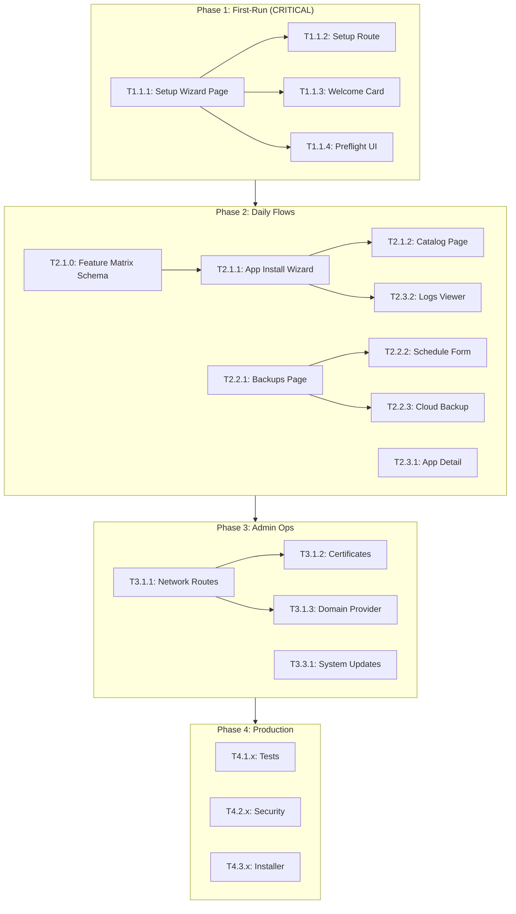

# LibreServ Development Roadmap

**Target Audience:** General users who shouldn't need a terminal  
**MVP Target:** April 30, 2026  
**Delivery Method:** Hardware with software pre-installed

This roadmap is organized by **user journey** so developers understand what matters most for MVP.

---

## Quick Navigation

- [Critical Path](#critical-path-what-must-work-for-mvp)
- [Phase 1: First-Run Experience](#phase-1-first-run-experience)
- [Phase 2: Daily User Flows](#phase-2-daily-user-flows)
- [Phase 3: Admin Operations](#phase-3-admin-operations)
- [Phase 4: Production Readiness](#phase-4-production-readiness)
- [Phase 5: Advanced Features](#phase-5-advanced-features)

---

## Critical Path: What MUST Work for MVP

```
User receives hardware → Powers on → Opens browser → 
Sees Setup Wizard → Creates admin account → 
Installs an app → It works → Creates backup → Done
```

**If any step in this flow is broken, MVP fails.**

### Must-Have Features (Priority Order)

| Priority | Feature | Why | Current State |
|----------|---------|-----|---------------|
| P0 | Setup Wizard Frontend | No terminal = must have GUI setup | ❌ MISSING |
| P0 | App Install Flow | Core value proposition | ⚠️ Backend exists, no wizard UI |
| P0 | Backup/Restore UI | "Actions should be reversible" | ❌ Backend only |
| P1 | HTTPS/Domain Setup | Production requirement | ⚠️ Backend exists, no UI |
| P1 | Domain Provider Integration | Remote access requires domain | ❌ MISSING |
| P1 | Cloud Backup Integration | Off-site backup for safety | ❌ MISSING |
| P1 | System Health Display | User confidence | ✅ Dashboard exists |

---

## Phase 1: First-Run Experience

**Goal:** User powers on and completes setup without terminal

### 1.1 Setup Wizard (CRITICAL - MISSING)

**Current State:** Backend has `/api/v1/setup/*` endpoints, but NO frontend page exists.

#### T1.1.1. Create Setup Wizard Page

**File:** `server/frontend/src/pages/SetupWizardPage.jsx`  
**Effort:** 4 hours  
**Dependencies:** None  
**Status:** 🔴 **CRITICAL - NOT STARTED**  
**Completed By:**

**User Journey:**
1. User opens browser to device IP
2. Sees welcome screen with plain-language intro
3. Enters admin username, password, email
4. Sees preflight checks (Docker OK, Disk OK, etc.)
5. Clicks "Complete Setup"
6. Redirects to dashboard, logged in

**Backend API (Already Exists):**
- `GET /api/v1/setup/status` - Check if setup complete
- `GET /api/v1/setup/preflight` - Check Docker, DB, disk space, SMTP
- `POST /api/v1/setup/complete` - Create admin user

**Acceptance Criteria:**
- [ ] Page checks `/api/v1/setup/status` on load
- [ ] If setup complete, redirects to login
- [ ] Shows preflight check results with icons (✓/✗)
- [ ] Form validates password strength
- [ ] Shows plain-language errors (not JSON dumps)
- [ ] Success redirects to dashboard with auto-login
- [ ] Works on mobile/tablet

**Example Code:**
- Backend handler: `server/backend/internal/api/handlers/setup.go:1-280`
- Existing login: `server/frontend/src/pages/Login.jsx` - Form patterns
- Router config: `server/backend/internal/api/router.go:132-136` - Setup routes

**Testing:**
```bash
# Reset setup state (testing only)
rm /var/lib/libreserv/setup.json  # or wherever state lives

# Open browser to http://localhost:8080
# Should see setup wizard, not login
```

---

#### T1.1.2. Add Setup Route to Frontend Router

**File:** `server/frontend/src/App.jsx` (or router file)  
**Effort:** 1 hour  
**Dependencies:** T1.1.1  
**Status:** 🔴  
**Completed By:**

**Acceptance Criteria:**
- [ ] Route `/setup` shows SetupWizardPage
- [ ] Root `/` redirects to `/setup` if not configured
- [ ] Route protected after setup (can't revisit)

---

#### T1.1.3. Create Welcome/Onboarding Component

**File:** `server/frontend/src/components/onboarding/WelcomeCard.jsx`  
**Effort:** 2 hours  
**Dependencies:** T1.1.1  
**Status:** 🔴  
**Completed By:**

**User Journey:**
After first login, show friendly welcome:
- "Your LibreServ is ready! Here's what you can do:"
- Quick links: Install an app, Set up HTTPS, Create backup

**Acceptance Criteria:**
- [ ] Shows after first login only (track in localStorage or user flags)
- [ ] 3-4 quick action cards
- [ ] "Don't show again" checkbox
- [ ] Dismissible

---

### 1.2 Preflight Checks UI

#### T1.1.4. Create Preflight Checks Component

**File:** `server/frontend/src/components/setup/PreflightChecks.jsx`  
**Effort:** 2 hours  
**Dependencies:** T1.1.1  
**Status:** 🔴  
**Completed By:**

**What to Build:**
Visual display of system checks from `/api/v1/setup/preflight`.

**Backend Returns:**
```json
{
  "checks": {
    "docker": {"status": "ok"},
    "database": {"status": "ok"},
    "disk_space": {"status": "ok", "disk_space_bytes_free": 1073741824},
    "smtp": {"status": "ok", "smtp_configured": false}
  },
  "healthy": true
}
```

**Acceptance Criteria:**
- [ ] Shows each check with ✓/✗ icon
- [ ] Shows disk space in human-readable format (GB)
- [ ] Shows warnings (not errors) for optional things like SMTP
- [ ] "Retry" button for failed checks
- [ ] Blocks setup completion if critical checks fail

---

## Phase 2: Daily User Flows

**Goal:** User can install apps, create backups, check status - all from web UI

### 2.1 App Installation Flow

**Current State:** Backend complete, frontend has basic pages but no install wizard

#### T2.1.0. Add App Feature Matrix Schema (Backend)

**File:** `server/backend/internal/apps/types.go`  
**Effort:** 3 hours  
**Dependencies:** None  
**Status:** ✅ Complete
**Completed By:** @maxl

**Why:** Apps need to declare capabilities so LibreServ can adapt UI and set user expectations.

**Schema:**
```go
type AppFeatures struct {
    AccessModel    AccessModel    `yaml:"access_model" json:"access_model"`
    Backup         FeatureSupport `yaml:"backup" json:"backup"`
    UpdateBehavior UpdateBehavior `yaml:"update_behavior" json:"update_behavior"`
    SSO            bool           `yaml:"sso" json:"sso"`
    CustomDomains  bool           `yaml:"custom_domains" json:"custom_domains"`
}

type AccessModel string
const (
    AccessModelSharedAccount   AccessModel = "shared_account"   // Single shared admin
    AccessModelIntegratedUsers AccessModel = "integrated_users" // Per-user accounts (default)
    AccessModelExternalAuth    AccessModel = "external_auth"    // App manages its own users
    AccessModelPublic          AccessModel = "public"           // No auth required
)
```

**Acceptance Criteria:**
- [x] Add `Features AppFeatures` field to `AppDefinition` struct
- [x] Add YAML parsing for `features:` section
- [x] Implement `GetDefaultFeatures()` for backward compatibility
- [x] Add `GET /api/v1/catalog/{app_id}/features` endpoint
- [x] Update `motioneye/app.yaml` with `access_model: shared_account`

**Implementation Notes:**
- Extended existing AppFeatures struct (was basic flags, now includes Feature Matrix v2)
- Added new types: AccessModel, FeatureSupport, UpdateBehavior, ResourceHints
- MotionEye now declares: access_model=shared_account, sso=false, backup=supported

**Testing:**
```bash
curl http://localhost:8080/api/v1/catalog/motioneye/features
# Should return {"access_model": "shared_account", "backup": "supported", ...}
```

---

#### T2.1.1. Create App Install Wizard

**File:** `server/frontend/src/components/app/InstallWizard.jsx`  
**Effort:** 4 hours  
**Dependencies:** T2.1.0 (Feature Matrix Schema)
**Status:** 🟡 In Progress
**Completed By:** @maxl

**User Journey:**
1. Browse app catalog → Click "Install"
2. See plain-language description ("Search the web privately")
3. **See feature warnings** (e.g., "Shared Account - all users share one login")
4. Configure any required settings (domain, password, etc.)
5. See install progress with logs
6. Get success message with "Open App" button

**Backend API:**
- `GET /api/v1/catalog` - List available apps
- `GET /api/v1/catalog/{app_id}/features` - Get app capabilities
- `POST /api/v1/apps` - Install app
- `GET /api/v1/apps/{id}/status` - Check status

**Acceptance Criteria:**
- [ ] Multi-step wizard (Select → Configure → Install → Done)
- [ ] Shows app logo, description in plain language
- [ ] Form fields generated from app.yaml configuration
- [ ] **Shows feature warnings based on access_model:**
  - `shared_account` → "Shared Account - All users access with same credentials"
  - `external_auth` → "External Auth - App manages its own users"
  - `public` → "Public Access - No login required"
- [ ] **Shows shared credentials input for shared_account apps**
- [ ] Shows real-time install progress
- [ ] Error messages in plain language
- [ ] "Open App" button on success
- [ ] Can go back to previous steps

**Example Code:**
- App definitions: `server/backend/apps/builtin/*/app.yaml`
- Catalog handler: `server/backend/internal/api/handlers/catalog.go`
- Install handler: `server/backend/internal/api/handlers/apps.go`

---

#### T2.1.2. Create App Catalog Page (Enhance Existing)

**File:** `server/frontend/src/pages/AppsPage.jsx` (EXISTS - enhance)  
**Effort:** 2 hours  
**Dependencies:** T2.1.1  
**Status:** 🔴  
**Completed By:**

**Current State:** Page exists but uses mock data from `services.js`

**Acceptance Criteria:**
- [ ] Replace mock data with live API call to `/api/v1/catalog`
- [ ] Group apps by category
- [ ] Show "Installed" badge on already-installed apps
- [ ] "Install" button opens wizard (T2.1.1)
- [ ] Search/filter functionality

---

#### T2.1.3. Add App Uninstall with Confirmation

**File:** Update `server/frontend/src/pages/AppDetailPage.jsx`  
**Effort:** 1.5 hours  
**Dependencies:** None  
**Status:** 🔴  
**Completed By:**

**User Journey:**
1. User clicks "Uninstall"
2. Sees warning: "This will delete all data for [App Name]"
3. Must type app name to confirm
4. Shows progress during uninstall
5. Redirects to app list when done

**Acceptance Criteria:**
- [ ] Confirmation modal with typing requirement
- [ ] Shows what will be deleted (volumes, config)
- [ ] Progress indicator during uninstall
- [ ] Cannot uninstall if backup in progress

---

### 2.2 Backup & Restore Flow

**Current State:** Backend complete (`/api/v1/backups/*`), no frontend

#### T2.2.1. Create Backups Page

**File:** `server/frontend/src/pages/BackupsPage.jsx`  
**Effort:** 3 hours  
**Dependencies:** None  
**Status:** 🔴  
**Completed By:**

**User Journey:**
1. See list of all backups (app name, date, size)
2. Click "Create Backup" for specific app
3. See backup progress
4. Click "Restore" to restore from backup
5. Confirmation: "This will replace current data"

**Backend API:**
- `GET /api/v1/backups` - List all backups
- `POST /api/v1/backups` - Create backup
- `POST /api/v1/backups/{id}/restore` - Restore
- `DELETE /api/v1/backups/{id}` - Delete

**Acceptance Criteria:**
- [ ] List backups sorted by date (newest first)
- [ ] Show app name, date, size, status
- [ ] "Create Backup" dropdown to select app
- [ ] Restore requires confirmation
- [ ] Show warning: "Current data will be replaced"
- [ ] Progress indicator during backup/restore
- [ ] Auto-refresh during operations

---

#### T2.2.2. Create Backup Schedule UI

**File:** `server/frontend/src/components/backups/ScheduleForm.jsx`  
**Effort:** 2 hours  
**Dependencies:** T2.2.1  
**Status:** 🔴  
**Completed By:**

**User Journey:**
User sets "Backup every day at 3 AM" for Nextcloud.

**Acceptance Criteria:**
- [ ] Cron-like schedule picker (or presets: daily/weekly)
- [ ] Select which apps to backup
- [ ] Retention policy (keep last N backups)
- [ ] Show next scheduled backup time
- [ ] Email notification on backup complete/fail

---

#### T2.2.3. Add Cloud Backup Integration

**Files:** `server/backend/internal/backup/cloud/`, `server/frontend/src/components/backups/CloudBackupConfig.jsx`  
**Effort:** 4 hours  
**Dependencies:** T2.2.1  
**Status:** 🔴  
**Completed By:**

**Why:** Local backups protect against app failure, but not hardware failure, theft, or disaster. Users need off-site backup for true data safety.

**User Journey:**
1. User goes to Backups → Cloud Storage
2. Chooses provider (Backblaze B2, S3-compatible, or "Manual Setup")
3. Enters credentials or follows setup guide
4. Tests connection
5. Enables "Upload backups to cloud after creation"
6. Sees cloud backup status on each backup entry

**Implementation Options:**
| Option | Effort | Pros | Cons |
|--------|--------|------|------|
| Backblaze B2 API | 3h | Simple, cheap, user-friendly | Single provider |
| S3-compatible API | 4h | Works with many providers | More complex config |
| rclone integration | 2h | Supports 40+ providers | External dependency |
| Manual setup guide | 1h | Zero code | User must use terminal |

**Recommended:** Start with "Manual Setup Guide" (instructions page), then add Backblaze B2 integration.

**Acceptance Criteria:**
- [ ] Cloud provider selection UI (Backblaze, S3, Manual)
- [ ] Credential input form with validation
- [ ] "Test Connection" button
- [ ] Toggle: "Upload backups to cloud automatically"
- [ ] Show cloud upload status on backup list
- [ ] Restore from cloud backup option
- [ ] Plain-language setup guide for manual option

**Backend API (to add):**
- `GET /api/v1/backups/cloud/providers` - List supported providers
- `POST /api/v1/backups/cloud/config` - Save cloud config
- `POST /api/v1/backups/cloud/test` - Test connection
- `POST /api/v1/backups/{id}/upload` - Upload to cloud
- `POST /api/v1/backups/cloud/download` - Download from cloud

---

### 2.3 App Status & Monitoring

**Current State:** Dashboard exists with health display

#### T2.3.1. Enhance App Detail Page

**File:** `server/frontend/src/pages/AppDetailPage.jsx` (EXISTS - enhance)  
**Effort:** 2 hours  
**Dependencies:** None  
**Status:** 🟡  
**Completed By:**

**Acceptance Criteria:**
- [ ] Show resource usage (CPU, RAM, disk) from `/api/v1/apps/{id}/metrics`
- [ ] Show app health status prominently
- [ ] Start/Stop/Restart buttons with confirmation
- [ ] Link to app's web interface (if applicable)
- [ ] Show installed version and available updates

---

#### T2.3.2. Create App Logs Viewer

**File:** `server/frontend/src/components/app/LogsViewer.jsx`  
**Effort:** 2.5 hours  
**Dependencies:** None  
**Status:** 🔴  
**Completed By:**

**User Journey:**
User sees "Something went wrong" → Clicks "View Logs" → Sees recent error messages

**Acceptance Criteria:**
- [ ] Modal or full-page log viewer
- [ ] Auto-scroll to bottom (newest logs)
- [ ] Pause/Resume scrolling
- [ ] Search/filter logs
- [ ] Download logs as text file
- [ ] Show last 500 lines by default, load more on scroll

**Backend API:** `GET /api/v1/apps/{id}/logs` (may need to add)

---

## Phase 3: Admin Operations

**Goal:** Admin can manage users, domains, and system from web UI

### 3.1 Network & HTTPS

**Current State:** Backend complete, no frontend

#### T3.1.1. Create Network Routes Page

**File:** `server/frontend/src/pages/NetworkRoutesPage.jsx`  
**Effort:** 3 hours  
**Dependencies:** None  
**Status:** 🔴  
**Completed By:**

**User Journey:**
1. Admin clicks "Network" → "Routes"
2. Sees all domains pointing to apps
3. Adds new domain: "blog.example.com" → "wordpress:8080"
4. System requests HTTPS certificate automatically

**Backend API:**
- `GET /api/v1/network/routes` - List routes
- `POST /api/v1/network/routes` - Create route
- `DELETE /api/v1/network/routes/{id}` - Delete route

**Acceptance Criteria:**
- [ ] List routes with domain, target, HTTPS status
- [ ] Add route form (domain, backend address)
- [ ] Test connectivity before saving
- [ ] Delete with confirmation
- [ ] Show Caddy status

---

#### T3.1.2. Create HTTPS/Certificate Page

**File:** `server/frontend/src/pages/CertificatesPage.jsx`  
**Effort:** 2.5 hours  
**Dependencies:** T3.1.1  
**Status:** 🔴  
**Completed By:**

**User Journey:**
1. Admin sees certificate status for each domain
2. Sees warning if cert expires soon
3. Clicks "Renew" to manually renew
4. Can request new certificate for domain

**Backend API:**
- `GET /api/v1/network/acme/status` - Certificate status
- `POST /api/v1/network/acme/request` - Request new cert

**Acceptance Criteria:**
- [ ] List certificates with domain, expiry, issuer
- [ ] Color-coded expiry (green > 30 days, yellow 7-30, red < 7)
- [ ] "Request Certificate" button
- [ ] Show ACME challenge progress
- [ ] Renew button for existing certs

---

#### T3.1.3. Add Domain Provider Integration

**Files:** `server/backend/internal/network/dns/`, `server/frontend/src/components/network/DomainProviderConfig.jsx`  
**Effort:** 4 hours  
**Dependencies:** T3.1.1  
**Status:** 🔴  
**Completed By:**

**Why:** Users need remote access to their server. This requires a domain name pointing to their home IP. Non-technical users cannot manually configure DNS records or dynamic DNS.

**User Journey:**
1. User goes to Network → Domain Setup
2. Sees options: "Buy new domain", "Use existing domain", or "Use free subdomain"
3. For existing domain: enters domain + provider credentials
4. System configures DNS automatically
5. System sets up Dynamic DNS (for home connections)
6. HTTPS certificate requested automatically

**Implementation Options:**
| Option | Effort | Pros | Cons |
|--------|--------|------|------|
| DDNS with libreserv.com subdomain | 4h | Zero config for user | Requires our infrastructure |
| Namecheap API | 3h | Popular, cheap | Single provider |
| Cloudflare API | 3h | Free DNS, popular | Single provider |
| DuckDNS integration | 2h | Free, simple | Limited to duckdns.org |
| Manual setup guide | 1h | Zero code | User must use terminal |

**Recommended:** Start with "Manual Setup Guide", then add DuckDNS (free) and Namecheap/Cloudflare APIs.

**Acceptance Criteria:**
- [ ] Domain setup wizard UI
- [ ] Provider selection (DuckDNS, Namecheap, Cloudflare, Manual)
- [ ] Credential input form with validation
- [ ] "Test DNS Configuration" button
- [ ] Dynamic DNS update service (for changing IPs)
- [ ] Auto-detect public IP
- [ ] Show current IP and last update time
- [ ] Plain-language setup guide for manual option

**Backend API (to add):**
- `GET /api/v1/network/dns/providers` - List supported providers
- `POST /api/v1/network/dns/config` - Save DNS config
- `POST /api/v1/network/dns/test` - Test DNS resolution
- `POST /api/v1/network/dns/update` - Force DDNS update
- `GET /api/v1/network/dns/status` - Current IP, last update

**Example Code:**
- Similar pattern to ACME handler: `server/backend/internal/api/handlers/acme.go`

---

### 3.2 User Management

**Current State:** Pages exist, need verification

#### T3.2.1. Verify & Enhance User Management

**File:** `server/frontend/src/pages/UsersPage.jsx` (EXISTS)  
**Effort:** 1.5 hours  
**Dependencies:** None  
**Status:** 🟡  
**Completed By:**

**Acceptance Criteria:**
- [ ] List all users with role, last login
- [ ] Create user with role selection
- [ ] Edit user (change password, role)
- [ ] Delete user with confirmation
- [ ] Cannot delete last admin
- [ ] Password strength indicator

---

### 3.3 System Administration

#### T3.3.1. Create System Updates Page

**File:** `server/frontend/src/pages/SystemUpdatesPage.jsx`  
**Effort:** 2 hours  
**Dependencies:** None  
**Status:** 🔴  
**Completed By:**

**User Journey:**
1. Admin sees "Update Available" badge
2. Clicks to view changelog
3. Clicks "Update Now"
4. Sees progress, system restarts
5. Logs back in to updated system

**Backend API:**
- `GET /api/v1/system/updates/check` - Check for updates
- `POST /api/v1/system/updates/apply` - Apply update

**Acceptance Criteria:**
- [ ] Show current version
- [ ] Check for updates button
- [ ] Show available version with changelog
- [ ] Update button with warning
- [ ] Progress during update
- [ ] Handle update failure gracefully

---

#### T3.3.2. Create Job Queue Monitor

**File:** `server/frontend/src/pages/JobQueuePage.jsx`  
**Effort:** 2 hours  
**Dependencies:** None  
**Status:** 🔴  
**Completed By:**

**Acceptance Criteria:**
- [ ] List background jobs (type, status, created, duration)
- [ ] Filter by status (running, completed, failed)
- [ ] Cancel running jobs
- [ ] Show error details for failed jobs
- [ ] Auto-refresh every 5 seconds

---

## Phase 4: Production Readiness

**Goal:** System is secure, tested, installable

### 4.1 Testing Coverage

#### T4.1.1. Test Platform Self-Update

**File:** `server/backend/internal/system/update_test.go`  
**Effort:** 2 hours  
**Dependencies:** None  
**Status:** 🔴  
**Completed By:**

**Acceptance Criteria:**
- [ ] Test `CheckForUpdate()` returns version info
- [ ] Test `DownloadUpdate()` with mock HTTP
- [ ] Test `VerifyChecksum()` with SHA256
- [ ] Test `ApplyUpdate()` with backup/rollback
- [ ] Test failure scenarios

---

#### T4.1.2. Test Security Validator

**File:** `server/backend/internal/security/validator_test.go`  
**Effort:** 2 hours  
**Dependencies:** None  
**Status:** 🔴  
**Completed By:**

**Acceptance Criteria:**
- [ ] Test path traversal prevention
- [ ] Test command injection prevention
- [ ] Test Docker flag validation
- [ ] Test domain validation

---

#### T4.1.3. Test Audit Logging

**File:** `server/backend/internal/audit/service_test.go`  
**Effort:** 1.5 hours  
**Dependencies:** None  
**Status:** 🔴  
**Completed By:**

---

#### T4.1.4. Test Job Scheduler

**File:** `server/backend/internal/jobs/scheduler_test.go`  
**Effort:** 2 hours  
**Dependencies:** None  
**Status:** 🔴  
**Completed By:**

---

#### T4.1.5. Integration Test: Full User Flow

**File:** `server/backend/tests/integration/user_flow_test.go`  
**Effort:** 4 hours  
**Dependencies:** T4.1.1-4  
**Status:** 🔴  
**Completed By:**

**Test Flow:**
```
Setup → Create Admin → Login → Install App → 
Create Backup → Restore Backup → Uninstall App
```

---

### 4.2 Security Hardening

#### T4.2.1. Security Audit: Authentication

**Effort:** 2 hours  
**Status:** 🔴  

**Checklist:**
- [ ] JWT uses secure algorithm (RS256 or HS256 with 32+ byte secret)
- [ ] Token expiration appropriate (access: <1hr, refresh: <30 days)
- [ ] Password hashing uses bcrypt with cost >= 10
- [ ] Brute force protection on login
- [ ] CSRF protection on state-changing requests

---

#### T4.2.2. Add Rate Limiting Middleware

**File:** `server/backend/internal/api/middleware/ratelimit.go` (verify exists)  
**Effort:** 2 hours  
**Status:** 🟡  
**Completed By:**

**Acceptance Criteria:**
- [ ] Rate limit by IP on public endpoints
- [ ] Rate limit by user on authenticated endpoints
- [ ] Stricter limits on auth endpoints
- [ ] Return 429 with Retry-After header

---

#### T4.2.3. Add Security Headers

**File:** `server/backend/internal/api/middleware/security.go`  
**Effort:** 1 hour  
**Status:** 🔴  
**Completed By:**

**Headers to Add:**
- X-Content-Type-Options: nosniff
- X-Frame-Options: DENY
- X-XSS-Protection: 1; mode=block
- Strict-Transport-Security (when HTTPS)

---

### 4.3 Installer & Hardware Delivery

#### T4.3.1. Enhance Install Script

**File:** `install.sh` (EXISTS)  
**Effort:** 2 hours  
**Status:** 🟡  
**Completed By:**

**Acceptance Criteria:**
- [ ] Installs systemd service
- [ ] Verifies service starts successfully
- [ ] Shows post-install instructions
- [ ] Supports upgrade (preserve data)
- [ ] Has uninstall option

---

#### T4.3.2. Create Systemd Service File

**File:** `libreserv.service`  
**Effort:** 1 hour  
**Status:** 🔴  
**Completed By:**

**Acceptance Criteria:**
- [ ] Correct user/group
- [ ] After=docker.service dependency
- [ ] Restart policy (always, 10s delay)
- [ ] Environment file support

---

#### T4.3.3. Create Debian ISO Builder

**File:** `scripts/create-iso.sh`  
**Effort:** 4 hours  
**Dependencies:** T4.3.1, T4.3.2  
**Status:** 🔴  
**Completed By:**

**Acceptance Criteria:**
- [ ] Downloads Debian netinstall
- [ ] Injects LibreServ binary
- [ ] Creates preseed for automated install
- [ ] Results in bootable ISO

---

#### T4.3.4. Create Hardware Detection Script

**File:** `scripts/hardware-detect.sh`  
**Effort:** 1.5 hours  
**Status:** 🔴  
**Completed By:**

**Acceptance Criteria:**
- [ ] Detect CPU, RAM, disk, GPU
- [ ] Warn if below minimum specs
- [ ] Generate hardware report for support

---

### 4.4 Documentation

#### T4.4.1. Create SECURITY.md

**Effort:** 1.5 hours  
**Status:** 🔴  

---

#### T4.4.2. Create OpenAPI Spec

**File:** `docs/openapi.yaml`  
**Effort:** 4 hours  
**Status:** 🔴  

---

#### T4.4.3. Update Architecture Diagrams

**Effort:** 2 hours  
**Status:** 🔴  

---

## Phase 5: Advanced Features

**Post-MVP features for competitive parity**

### 5.1 Multi-User System

| Task | Effort | Status |
|------|--------|--------|
| Role definitions (admin/operator/viewer) | 2h | 🔴 |
| Role-based access middleware | 2h | 🔴 |
| User invite system | 2.5h | 🔴 |
| Role management UI | 2h | 🔴 |

---

### 5.2 App Marketplace

| Task | Effort | Status |
|------|--------|--------|
| Community app submission API | 3h | 🔴 |
| App review workflow | 3h | 🔴 |
| Rating/reviews system | 2h | 🔴 |

---

### 5.3 Remote Access

| Task | Effort | Status |
|------|--------|--------|
| Tailscale integration | 3h | 🔴 |
| Cloudflare Tunnel support | 3h | 🔴 |

---

### 5.4 Notifications

| Task | Effort | Status |
|------|--------|--------|
| Email notification templates | 2h | 🔴 |
| Webhook notifications | 2h | 🔴 |
| Push notifications | 3h | 🔴 |

---

### 5.5 Enterprise

| Task | Effort | Status |
|------|--------|--------|
| OIDC/SSO integration | 4h | 🔴 |
| LDAP support | 4h | 🔴 |
| Multi-server clustering | 6h | 🔴 |

---

## Dependency Graph



---

## Summary Statistics

| Phase | Tasks | Effort | Critical? |
|-------|-------|--------|-----------|
| Phase 1: First-Run | 4 | 9h | **YES** |
| Phase 2: Daily Flows | 8 | 22h | **YES** |
| Phase 3: Admin Ops | 6 | 15h | YES |
| Phase 4: Production | 14 | 24h | YES |
| Phase 5: Advanced | 14 | 38h | NO |
| **Total** | **46** | **~108h** | |

---

## Definition of Done

For every task:
- [ ] Code written following project conventions
- [ ] Tests pass (`go test ./...` or `npm test`)
- [ ] No lint errors
- [ ] Manual testing confirms it works
- [ ] Works on mobile/tablet (for UI)
- [ ] Error messages are plain-language (no JSON dumps to users)
- [ ] Actions are reversible or have confirmation

---

## Getting Started

**Start with T1.1.1 (Setup Wizard Page)** - This is the most critical missing piece.

The backend API exists. The frontend page does not. Creating this unblocks the entire first-run experience.

```bash
# Quick start for T1.1.1
cd server/frontend
npm run dev

# Create the page
touch src/pages/SetupWizardPage.jsx

# Check backend API
curl http://localhost:8080/api/v1/setup/status
curl http://localhost:8080/api/v1/setup/preflight
```

---

## Changelog

| Date | Change |
|------|--------|
| 2026-02-17 | Added T2.2.3: Cloud Backup Integration, T3.1.3: Domain Provider Integration |
| 2026-02-17 | Restructured around user journeys, added missing Setup Wizard |
| 2026-02-17 | Added T2.1.0: App Feature Matrix Schema (from feature request) |
| 2026-02-17 | T2.1.0: Implemented types.go, motioneye/app.yaml with access_model=shared_account |
| 2026-02-18 | T2.1.0: Marked complete; T2.1.1: Started App Install Wizard |
