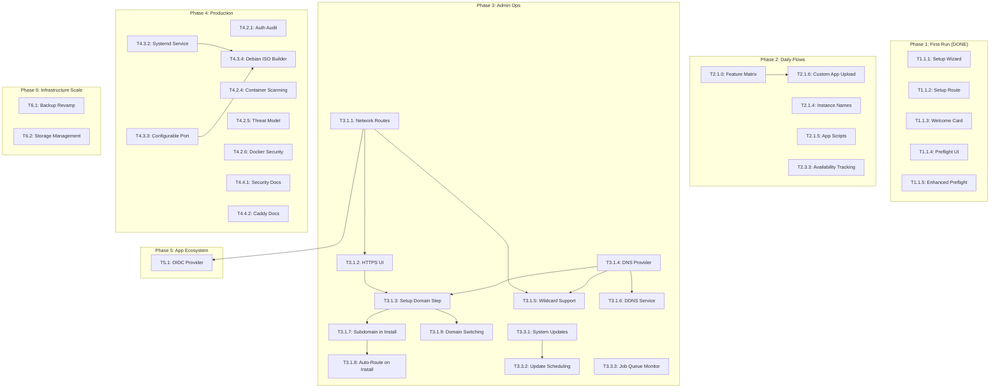

# LibreServ Development Roadmap

**Target Audience:** General users who shouldn't need a terminal
**Delivery Method:** Hardware with software pre-installed

This roadmap is organized by **user journey** so developers understand what matters most.

---

## Quick Navigation

- [Critical Path](#critical-path)
- [Phase 1: First-Run Experience](#phase-1-first-run-experience) — DONE
- [Phase 2: Daily User Flows](#phase-2-daily-user-flows) — IN PROGRESS
- [Phase 3: Admin Operations](#phase-3-admin-operations) — IN PROGRESS (Domain & Network Setup major rewrite 2026-04-15)
- [Phase 4: Production Readiness](#phase-4-production-readiness) — IN PROGRESS
- [Phase 5: App Ecosystem](#phase-5-app-ecosystem) — PLANNED
- [Phase 6: Infrastructure Scale](#phase-6-infrastructure-scale) — PLANNED
- [Phase 7: Advanced Features](#phase-7-advanced-features) — PLANNED

---

## Critical Path

```
User receives hardware -> Powers on -> Opens browser ->
Sees Setup Wizard -> Creates admin account ->
Installs an app -> It works -> Creates backup -> Done
```

**If any step in this flow is broken, nothing else matters.**

### Must-Have Features (Priority Order)

| Priority | Feature | Why | Current State |
|----------|---------|-----|---------------|
| P0 | Setup Wizard | No terminal = must have GUI setup | Done |
| P0 | App Install Flow | Core value proposition | Done |
| P0 | Backup/Restore | "Actions should be reversible" | Done (basic) |
| P1 | Domain Setup in Setup Wizard | NPM-style domain onboarding | Not started |
| P1 | HTTPS/Domain Setup | Production requirement | Backend done, no UI |
| P1 | DNS Provider Integration | Remote access requires domain | Done (Cloudflare) |
| P1 | System Health Display | User confidence | Done |
| P2 | Network Routes UI | Manage app access | Mostly done, needs polish |
| P2 | BLE Companion (Linux) | Reach UI without network | In progress (Libadwaita GTK4 app built) |
| P3 | BLE Companion (Android) | Same flow on Android | Deferred to team — null-safe code in repo, APK builds clean |

---

## Phase 1: First-Run Experience

**Goal:** User powers on and completes setup without terminal

### T1.1.1. Setup Wizard Page

**Status:** Done

**File:** `server/frontend/src/pages/SetupPage.jsx`

- Welcome screen with plain-language intro
- Admin account creation (username, password, email)
- Preflight checks (Docker, DB, disk space, permissions)
- Domain configuration step (Cloudflare or nameserver fallback)
- SMTP setup step with provider presets (Proton, Resend, Postmark, Custom)
- Auto-redirect to dashboard on completion

### T1.1.2. Setup Route

**Status:** Done

- Route `/setup` shows SetupPage
- SetupPage redirects to root if already configured

### T1.1.3. Welcome/Onboarding Component

**Status:** Done

**File:** `server/frontend/src/components/onboarding/WelcomeCard.jsx`

- Shows after first login only (localStorage)
- 3 quick action cards (Install App, Configure Settings, Read Docs)
- Dismissible with "Don't show again"

### T1.1.4. Preflight Checks UI

**Status:** Done

- Each check with pass/fail icon
- Disk space in human-readable format
- Warnings for optional things (SMTP)
- Retry button for failed checks
- Blocks setup if critical checks fail

### T1.1.5. Enhanced Preflight Permission Checks

**Status:** Done

- Detects root-owned/read-only directories
- Plain-language error messages
- Technical details logged server-side
- Checks grouped by category (system, storage, network)

### T1.1.6. BLE Companion App

**Status:** In progress (Linux companion rebuilt with Libadwaita UI; Android null-safe build in repo, deferred to team; no iOS companion planned)

**Goal:** Let users reach the LibreServ Web UI over Bluetooth LE when normal network routing is unavailable (e.g., during first-run setup, on a disconnected LAN, or when mDNS/routing fails).

**Architecture:** Three-part system:

1. **Server-side BLE peripheral** (`server/backend/internal/network/bluetooth/`) — GATT service advertising the LibreServ UUID, authenticating companions with the 6-char setup code, and proxying HTTP requests through the internal chi router (no TCP loopback). Build-tag gated: only compiled with `BUILD_TAGS=libreserv_ble make build` or `make ble-run`. Without the tag, a no-op stub is used.

2. **Linux companion** (`companion/linux/`) — Libadwaita GTK4 app with a minimal connection helper (logo, setup code entry, Connect button, status). On success, starts a local HTTP proxy on `127.0.0.1:18080` and opens the browser via `xdg-open`. Built with `gotk4` + `gotk4-adwaita`.

3. **Android companion** (`companion/android/`) — Null-safe Kotlin build in repo, ready for the team. Same scan → connect → authenticate → proxy flow with a WebView. Shows a "Connection lost — reconnecting…" banner on BLE disconnect. Targets API 26+ (Android 8.0+).

**GATT Service UUID:** `5a494c42-6572-6572-7600-000000000000` (4 characteristics: Auth write, Auth Status notify, Proxy Request write, Proxy Response notify).

**Remaining work (Linux):**
- [ ] BLE toggle/status in Settings → Network UI
- [ ] Linux companion: MTU negotiation (currently relies on default ~23-byte usable MTU)
- [ ] Linux companion: WebKitGTK embedded WebView (deferred — opens external browser currently)

**Remaining work (Android):** Deferred to LibreServ team.

**Not planned:** iOS companion.

---

## Phase 2: Daily User Flows

**Goal:** User can install apps, create backups, check status — all from web UI

### 2.1 App Installation

#### T2.1.0. App Feature Matrix Schema

**Status:** Done

- `AccessModel` types: `shared_account`, `integrated_users`, `external_auth`, `public`
- `FeatureSupport`, `UpdateBehavior`, `ResourceHints` types
- `GET /api/v1/catalog/{app_id}/features` endpoint

#### T2.1.1. App Install Wizard

**Status:** Done

- Multi-step wizard (Select -> Configure -> Install -> Done)
- Feature warnings based on access model
- Shared credentials input for shared_account apps
- Real-time install progress
- "Open App" button on success

#### T2.1.2. App Catalog Page

**Status:** Done

- Live API data from `/api/v1/catalog`
- Category grouping, search/filter
- "Installed" badge on already-installed apps

#### T2.1.3. App Uninstall with Confirmation

**Status:** Done

- Confirmation modal with typing requirement
- Shows what will be deleted (volumes, config)
- Progress indicator during uninstall
- Start/Stop/Restart buttons

#### T2.1.4. Custom App Instance Names

**Status:** Not started

**Effort:** 3h

**Dependencies:** None

Allow installing multiple instances of the same app, each with a custom name.

**Acceptance Criteria:**
- [ ] Install wizard allows naming each instance
- [ ] Instance name shown in app list and detail page
- [ ] Port conflicts detected and resolved automatically
- [ ] Each instance has independent config, volumes, and state

#### T2.1.5. Revamp App Templates for Production

**Status:** Not started

**Effort:** 20h

**Dependencies:** None

The current app templates are stubs only suitable for basic dev testing. All lifecycle scripts (update, repair, backup, restore) are placeholder echo-and-exit stubs. This task is a ground-up revamp: re-evaluate the app selection, replace stub scripts with production-grade implementations, and ensure each app is reliable enough for real use.

**Current state:** All builtin apps (ConvertX, LibreChat, Nextcloud AIO, Ollama, SearXNG, MotionEye) have non-functional lifecycle scripts. MotionEye has partial implementations but is incomplete. The app selection itself may change — some apps may be replaced or added based on production readiness.

**Scope:**
- Audit and decide which apps to keep, replace, or add
- Rewrite all lifecycle scripts from scratch with real logic
- Implement proper update (image pull, data migration, restart), repair (health checks, config validation, container recovery), backup (data export, metadata), and restore (data import, validation) for each app
- Test each script against real Docker containers

#### T2.1.6. Custom App Upload and URL Install

**Status:** Dropped

**Reason:** Replaced by repository-only model. Custom app submission is now handled through community app repositories. See Phase 6.3 for future ecosystem extensions.

### 2.2 Backup & Restore

#### T2.2.1. Backups Page

**Status:** Done

**Files:** Settings page (`server/frontend/src/pages/SettingsPage.jsx`) with backup sub-panels (`server/frontend/src/components/backups/`)

- List backups sorted by date (newest first)
- Create/restore/delete with progress indicators
- Cloud backup status display

#### T2.2.2. Backup Schedule UI

**Status:** Done

**File:** `server/frontend/src/components/backups/BackupScheduleCard.jsx`

- Preset schedules (Daily, Every 6h, Weekly)
- Custom cron support
- Retention policy (keep last N)
- Shows next scheduled run time

#### T2.2.3. Cloud Backup Integration

**Status:** Done

- Backblaze B2 and S3-compatible providers
- Credential encryption (AES-256-GCM)
- Auto-upload after backup creation when enabled
- "Test Connection" button

#### T2.2.4. Backup Download/Upload & Database Backup

**Status:** Done

- Download backup files from web UI
- Upload `.tar.gz` backup files with progress
- Unattached backups section (deleted apps + uploaded)
- Restore unattached backup to any installed app
- "Save DB" and "Upload & Restore DB" buttons

### 2.3 App Status & Monitoring

#### T2.3.1. App Detail Page (Enhanced)

**Status:** Done

- Resource usage (CPU, RAM, disk) from `/api/v1/apps/{id}/metrics`
- Health status icon
- Start/Stop/Restart with confirmation
- Link to app's web interface
- Installed version and available updates

#### T2.3.2. System Health Display

**Status:** Done

**File:** `server/frontend/src/components/cards/SystemHealthCard.jsx`

- Dashboard widget showing overall system health
- Real-time CPU, Memory, and Disk usage bars with warning thresholds
- Health indicators for API, Database, Docker, and SMTP services
- Color-coded status (Healthy/Unhealthy/Warning/Unknown)
- Auto-refresh with dashboard refresh interval

#### T2.3.2. App Logs Viewer

**Status:** Done

**File:** `server/frontend/src/components/app/LogsViewer.jsx`

- Full-page log viewer with auto-scroll
- Pause/Resume scrolling
- Search/filter logs
- Download logs as text file
- Last 500 lines by default, load more on scroll

#### T2.3.3. Improve Availability Tracking

**Status:** Not started

**Effort:** 4h

**Dependencies:** None

Implement a global system to track uptime and availability of apps and the server itself.

**Acceptance Criteria:**
- [ ] Per-app uptime/downtime tracking (already partially in `InstalledApp`)
- [ ] Server-level uptime tracking
- [ ] Availability percentage calculation (rolling 7d/30d)
- [ ] Dashboard widget showing overall system health
- [ ] Historical availability data persisted in database

---

## Phase 3: Admin Operations

**Goal:** Admin can manage users, domains, and system from web UI

### 3.1 Domain & Network Setup

**Overview:** LibreServ's domain system gives every app its own subdomain under the user's domain. During setup, users connect their domain through one of three natively-supported providers (Cloudflare, Porkbun, Spaceship) or via the universal Cloudflare nameserver fallback (works with any registrar). Wildcard certificates are requested via DNS-01 ACME challenges, and a background service keeps DNS records in sync as the user's public IP changes. SMTP setup was added as the third setup wizard step (after Domain), with provider presets for Proton, Resend, Postmark, and Custom SMTP.

#### T3.1.1. Network Routes Page

**Status:** Mostly done, needs polish

**Effort:** 1h

**Dependencies:** None

**User Journey:**
1. Admin clicks "Network" -> "Routes"
2. Sees all domains pointing to apps
3. Adds new domain: "blog.example.com" -> "wordpress:8080"
4. System requests HTTPS certificate automatically

**Backend API (exists):**
- `GET /api/v1/network/routes` — List routes
- `POST /api/v1/network/routes` — Create route
- `DELETE /api/v1/network/routes/{id}` — Delete route

**Acceptance Criteria:**
- [x] List routes with domain, target, HTTPS status
- [x] Add route form (domain, backend address)
- [ ] Test connectivity before saving (frontend wiring)
- [x] Delete with confirmation
- [x] Show Caddy status

#### T3.1.2. HTTPS/Certificate Page

**Status:** Backend done, needs frontend UI

**Effort:** 2.5h

**Dependencies:** T3.1.1

**User Journey:**
1. Admin goes to Network -> Certificates
2. Sees all active certificates with expiry dates
3. Can manually request or renew a certificate
4. Clear warning shown for expiring certs

**Backend API (exists):**
- `GET /api/v1/network/acme/certificates` — List certificates
- `POST /api/v1/network/acme/request` — Request a certificate
- `GET /api/v1/network/acme/jobs/{jobID}` — Check request job status

**Acceptance Criteria:**
- [ ] Certificate list with domain, issuer, expiry, status
- [ ] Expiry countdown (red warning < 30 days, green > 60 days)
- [ ] Manual renew button
- [ ] Request new certificate form
- [ ] Job status polling UI during request

#### T3.1.3. Domain Setup in First-Run Wizard

**Status:** Done

**Effort:** 4h

**Dependencies:** T3.1.4

Adds a domain configuration step to the setup wizard (required, with "Skip (not recommended)" override). Appears after account creation.

**User Journey:**
1. After account creation, user sees "Connect your domain" step
2. Four options presented: Cloudflare / Porkbun / Spaceship / Use Cloudflare Nameservers
3. For provider options: credential input + test connection
4. For "Use Cloudflare Nameservers": guided walkthrough to switch nameservers, then credential input
5. Wildcard DNS record (`*`) created automatically for supported providers
6. First HTTPS certificate requested

**Acceptance Criteria:**
- [ ] New wizard step between account creation and redirect
- [ ] "Skip (not recommended)" override with warning
- [ ] Four provider options with plain-language descriptions
- [ ] Provider-specific credential forms with validation
- [ ] Connection test before proceeding
- [ ] "Use Cloudflare Nameservers" walkthrough (nameserver switch guide + Cloudflare account setup)
- [ ] Wildcard DNS record creation on provider confirmation
- [ ] First certificate requested automatically
- [ ] Success confirmation before proceeding

#### T3.1.4. DNS Provider Integration

**Status:** Done (Cloudflare)

**Effort:** 6h

**Dependencies:** None

Provider-agnostic DNS management via a `DNSProvider` Go interface with three native implementations plus one universal fallback.

**Provider Architecture:**

```
Native providers (direct DNS API):
  ├── Cloudflare  → cloudflare-go SDK
  ├── Porkbun     → simple REST client
  └── Spaceship   → simple REST client

Cloudflare delegation (universal fallback):
  └── User changes nameservers at their registrar
      → Falls through to Cloudflare path
```

**Supported registrars via native API:**
| Provider | DNS API | Wildcard records | DNS-01 ACME |
|---|---|---|---|
| Cloudflare | Yes (official SDK) | Yes | Yes |
| Porkbun | Yes (simple REST) | Yes | Yes |
| Spaceship | Yes (REST, libdns) | Yes | Yes |

**"Use Cloudflare Nameservers" fallback:** Works with any registrar (Namecheap, GoDaddy, Dynadot, Gandi, etc.). User does a one-time manual nameserver switch to Cloudflare, then all DNS management happens via Cloudflare's API.

**Backend API (to add):**
- `GET /api/v1/network/dns/providers` — List supported providers
- `POST /api/v1/network/dns/config` — Save provider + credentials
- `POST /api/v1/network/dns/test` — Test connection
- `POST /api/v1/network/dns/update` — Trigger DDNS update
- `GET /api/v1/network/dns/status` — Current DNS status
- `GET /api/v1/network/dns/records` — List current records
- `POST /api/v1/network/dns/records` — Create/update records (wildcard + root)

**Acceptance Criteria:**
- [x] `DNSProvider` Go interface (abstract, provider-agnostic)
- [x] Cloudflare implementation (via `libdns/cloudflare`)
- [x] Credential validation on save
- [x] SQLite persistence (`dns_provider_configs` table)
- [x] Config file support (`network.dns` in `libreserv.yaml`)
- [x] Wired into DI chain (`router.go`)
- [ ] Porkbun implementation — deferred
- [ ] Spaceship implementation — deferred
- [ ] Wildcard A/AAAA record creation (`*` subdomain + root `@`) — T3.1.5
- [ ] Universal Cloudflare nameserver fallback (nameserver change guide, Cloudflare account flow) — T3.1.3
- [ ] API endpoints for DNS management — T3.1.3

#### T3.1.5. Wildcard Domain Support

**Status:** Done

**Effort:** 3h

**Dependencies:** T3.1.1

Adds wildcard record support to Caddy and the certificate system.

**Acceptance Criteria:**
- [x] Caddyfile template generates wildcard catch-all blocks (`*.example.com { respond 404 }`)
- [x] Wildcard cert via DNS-01 (lego with stored DNS provider credentials)
- [x] Single SAN cert covers both `*.example.com` and `example.com` in one lego invocation
- [x] Certs stored in `wildcard.example.com/` dir, apex in `example.com/` dir
- [x] Wildcard cert auto-discovered for subdomain routes (fallback in `manualTLSPaths`)
- [x] `SetupWildcardDNS()` creates apex + wildcard A records via libdns
- [x] `DetectPublicIP()` for public IP detection in wizard + DDNS

#### T3.1.6. DDNS Auto-Update Service

**Status:** Done

**Files:** `server/backend/internal/network/ddns.go`, `server/backend/internal/api/handlers/ddns.go`, `server/frontend/src/components/settings/categories/NetworkCategory.jsx` (DDNS section)

**Effort:** 3h
**Dependencies:** T3.1.4 ✅

Background service that monitors the public IP address and updates DNS records when it changes.

**Acceptance Criteria:**
- [x] Background goroutine runs on configurable interval (default: 5 min)
- [x] Detects public IP via external services (ipify, icanhazip)
- [x] Updates wildcard A/AAAA record via provider API on IP change
- [x] Logs DDNS events to audit log
- [x] Toggle to enable/disable from Settings → Network
- [x] Manual "Update now" button
- [x] Configurable update interval (1-60 minutes)
- [x] Status display (current IP, last update, errors)

#### T3.1.7. Subdomain Selection in App Install

**Status:** Not started

**Effort:** 3h

**Dependencies:** T3.1.3

Adds a subdomain picker step to the app install wizard, shown only when a domain is configured.

**User Journey:**
1. During app install, after configuration step
2. If domain is configured: "Choose a subdomain for this app"
3. Auto-suggests based on app name (e.g., "nextcloud" for Nextcloud)
4. Each backend gets its own subdomain (e.g., "nextcloud-ui", "nextcloud-admin")
5. User confirms or customizes the subdomain
6. Shown during install progress: "Creating subdomain..." alongside "Pulling image..."

**Acceptance Criteria:**
- [ ] New wizard step (only when domain configured)
- [ ] Auto-suggest from app name + backend name
- [ ] Validation: lowercase, no spaces, no special chars
- [ ] Conflict detection (warn if subdomain taken)
- [ ] Custom subdomain input with validation
- [ ] Per-backend subdomain fields for multi-backend apps
- [ ] Subdomain creation via DNS provider API on confirmation

#### T3.1.8. Auto-Route Creation on App Install

**Status:** Not started

**Effort:** 2h

**Dependencies:** T3.1.7

Wires the install completion → Caddy route creation → certificate request into one seamless flow.

**Acceptance Criteria:**
- [ ] On install completion, create Caddy route for each chosen subdomain
- [ ] Trigger wildcard or per-subdomain cert request immediately
- [ ] App available on subdomain within seconds of install completing
- [ ] Route creation logged to audit log
- [ ] Rollback: if route or cert creation fails, clean up and warn user
- [ ] App appears in Network Routes page immediately after install

#### T3.1.9. Setup Wizards: Dead-Simple Step-by-Step UX

**Status:** In progress (SMTP wizard implemented, domain wizard needs UX pass)

**Effort:** 8h

**Dependencies:** T3.1.3, SMTP setup

The domain and email setup wizards currently assume users can infer what to do from field labels and brief help text. They can't. Users need to be walked through every single action, told exactly what to click, where to find things on their provider's website, and what the result should look like. No ambiguity. No "figure it out" gaps.

**Principles:**
- Every step has a numbered instruction list ("1. Go to cloudflare.com → 2. Click your domain → 3. Scroll to DNS → 4. Click Add Record → 5. Paste this value")
- Never show a bare input field without explaining where its value comes from
- Show expected results ("You should see a green checkmark" / "The page should say 'DNS record created'")
- Provider-specific screenshots or illustrated guides where possible
- Error messages must say what to DO, not just what went wrong ("Cloudflare rejected the API token. Go to cloudflare.com/profile/api-tokens, click the three dots on your token, and click Roll. Then paste the new token here.")

**Scope:**
- Domain wizard: provider-specific walkthroughs for Cloudflare, Porkbun, Spaceship, and the Cloudflare nameserver fallback. Each needs: where to log in, where to find API credentials, what to click, what to paste, what success looks like
- SMTP wizard: provider-specific walkthroughs for each preset (Proton, Resend, Postmark, Custom). Where to find the SMTP token/password, where to find the from-address, what "send a test email" actually does
- DNS verification step: explain what a DNS record is in one sentence, show the exact record being created, explain propagation wait times
- Certificate request step: explain that HTTPS is being set up, show progress, explain what "DNS-01 challenge" means in plain terms ("We're proving you own this domain by adding a temporary DNS record")

**Acceptance Criteria:**
- [ ] Domain wizard: every provider option has numbered step-by-step instructions for credential retrieval
- [ ] SMTP wizard: every preset has numbered step-by-step instructions for finding SMTP credentials
- [ ] No input field appears without an explanation of where its value comes from
- [ ] Error messages prescribe a concrete next action, not just describe the failure
- [ ] Success states are explicitly described ("You should see...")
- [ ] Technical concepts (DNS records, ACME challenges, SMTP auth) explained in one plain sentence at point of use

#### T3.1.10. Domain Management in Settings

**Status:** Done

**Files:** `server/frontend/src/components/settings/categories/DomainManagementCard.jsx`, `server/backend/internal/api/handlers/network.go`

**Effort:** 2h

**Dependencies:** T3.1.3 ✅, T3.1.9

Settings UI to view, change, and disconnect the current domain configuration.

**Acceptance Criteria:**
- [x] Settings → Network: show current domain prominently
- [x] "Change domain" button → redirects to setup wizard
- [x] "Disconnect domain" button with confirmation modal
- [x] Warning about consequences (DNS records removed, routes cleared)
- [x] Disconnect endpoint clears default domain from Caddy config
- [x] Plain-language error messages

---

**Phase 3.1 Deferred:**

| Task | Reason |
|---|---|
| Free subdomain service (`*.host.libreloom.org`) | Requires new LibreLoom DNS infrastructure |
| NAT type detection (none / NAT / CGNAT) | STUN-based, separate from domain work |
| Auto port forwarding (UPnP/NAT-PMP) | UPnP library, separate from domain work |
| CGNAT guidance (VPS tunnels, Nord MeshNet) | Depends on NAT detection |
| Guided domain purchase (link-out + guides) | Later phase |
| In-app domain purchase (registrar reseller) | Way future |

### 3.2 User Management

#### T3.2.1. User Management

**Status:** Done

- List all users with role, last login
- Create user with role selection
- Edit user (change password, role)
- Delete user with confirmation
- Cannot delete last admin
- Password strength indicator

### 3.3 System Administration

#### T3.3.1. System Updates Page

**Status:** Done

**Files:** `server/frontend/src/components/settings/categories/SystemUpdatesCard.jsx` and `server/frontend/src/components/settings/categories/GeneralCategory.jsx`

**Effort:** 2h

**Dependencies:** None

**User Journey:**
1. Admin goes to Settings → System
2. Clicks "Check for Updates"
3. Sees current version and available update (if any)
4. Clicks "Update Now" with confirmation modal
5. System downloads, applies update, and restarts
6. User logs back in to updated system

**Backend API (exists):**
- `GET /api/v1/system/updates/check` — Check for updates
- `POST /api/v1/system/updates/apply` — Apply update

**Acceptance Criteria:**
- [x] Show current version
- [x] Check for updates button
- [x] Show available version with changelog
- [x] Update button with warning modal
- [x] Loading states during check/update
- [x] Handle update failure gracefully
- [x] Auto-redirect to login after update

#### T3.3.2. Update Scheduling and Orchestration UI

**Status:** Not started

**Effort:** 3h

**Dependencies:** T3.3.1

Scheduled updates for both the platform and individual apps.

**Acceptance Criteria:**
- [ ] Schedule app updates (daily, weekly, manual)
- [ ] Pre-update backup option
- [ ] Rollback on failure
- [ ] Update orchestration (update multiple apps in sequence)
- [ ] Notification on update completion/failure

#### T3.3.3. Job Queue Monitor

**Status:** Not started

**Effort:** 2h

**Dependencies:** None

**Acceptance Criteria:**
- [ ] List background jobs (type, status, created, duration)
- [ ] Filter by status (running, completed, failed)
- [ ] Cancel running jobs
- [ ] Show error details for failed jobs
- [ ] Auto-refresh every 5 seconds

---

## Phase 4: Production Readiness

**Goal:** System is secure, tested, installable

### 4.1 Testing

#### T4.1.1. Platform Self-Update Tests

**Status:** Needs Updating

13 tests in `internal/system/update_test.go` - tests update checker logic but not the full self-update process (download, apply, restart).

#### T4.1.2. Security Validator Tests

**Status:** Done — 21 tests across 2 files (config validation, secrets, CORS, event types)

#### T4.1.3. Audit Logging Tests

**Status:** Done — 7 tests (CRUD round-trip, ordering, limits, nil metadata)

#### T4.1.4. Job Scheduler Tests

**Status:** Done — 3 tests (constructor, lifecycle, double-stop)

#### T4.1.5. Integration Test: Full User Flow

**Status:** Done — Full flow from setup through login, registration, and token invalidation

#### T4.1.6. Improve Test Coverage

**Status:** In progress

**Effort:** Ongoing

General test coverage improvement across the codebase.

### 4.2 Security

#### T4.2.1. Security Audit: Authentication

**Status:** Done

**Verification (2026-04-15):**
- JWT uses HS256 with 32+ byte secret (auto-generated)
- Token expiration: 15min access, 7d refresh
- Bcrypt cost = 12
- Brute force protection: 5 attempts in 10min → 15min lockout
- CSRF protection via middleware

#### T4.2.2. Rate Limiting Middleware

**Status:** Done

- Rate limit by IP on public endpoints
- Rate limit by user on authenticated endpoints
- Stricter limits on auth endpoints
- 429 with Retry-After header

#### T4.2.3. Security Headers

**Status:** Done

- X-Content-Type-Options: nosniff
- X-Frame-Options: DENY
- X-XSS-Protection: 1; mode=block
- Strict-Transport-Security (when HTTPS)

#### T4.2.4. Container Image Security Scanning

**Status:** Approved

CI includes govulncheck, gosec, staticcheck. SECURITY.md documents Trivy scanning intent.

#### T4.2.5. Threat Modeling

**Status:** Not started

**Effort:** 4h

Create a formal threat model for LibreServ.

**Deliverables:**
- [ ] STRIDE analysis
- [ ] Attack surface documentation
- [ ] Risk assessment with mitigations
- [ ] Security architecture diagram

#### T4.2.6. Docker Security Hardening

**Status:** Not started

**Effort:** 3h

Document and enforce Docker security best practices.

**Acceptance Criteria:**
- [ ] App sandboxing documentation
- [ ] Default container security policies (no privileged, no host network)
- [ ] Resource limits enforcement
- [ ] Network isolation between apps

### 4.3 Configuration & Deployment

#### T4.3.1. Enhanced Install Script

**Status:** Done

- Installs systemd service
- Verifies service starts successfully
- Shows post-install instructions
- Supports upgrade (preserve data)
- Has uninstall option

#### T4.3.2. Systemd Service File

**Status:** Hopefully done?

Full implementation in install.sh: correct user/group, After=docker, Restart=always, security hardening (NoNewPrivileges, ProtectSystem, ProtectHome, PrivateTmp).

#### T4.3.3. Configurable Server Port

**Status:** Implemented (Untested)

`Server.Port` in config, defaults to 8080, uses viper with LIBRESERV prefix → works as `LIBRESERV_SERVER_PORT` env var.

#### T4.3.4. Debian ISO Builder
**Status:** Not started

**Effort:** 4h

**Dependencies:** T4.3.1, T4.3.2, T4.3.3

**Acceptance Criteria:**
- [ ] Downloads Debian netinstall
- [ ] Injects LibreServ binary
- [ ] Creates preseed for automated install
- [ ] Results in bootable ISO

#### T4.3.5. Embedded App Repository

**Status:** Not started

**Effort:** 3h

Migrate the app repository to a proper Git repository as the source of truth. Only testing/sample applications should be embedded in the binary or release artifacts.

**Current state:** 7 builtin apps exist in `server/backend/apps/builtin/` on disk but are not embedded in the binary. They must be copied to `/opt/libreserv/catalog/builtin/` at install time.

**Goal:** Production apps live in a versioned Git repository (e.g. `gt.plainskill.net/LibreLoom/libreserv-apps`). The binary ships with zero builtin apps by default. A post-install setup step clones the app repo. The built-in placeholder apps are replaced by a minimal set of real testing apps embedded for development/demonstration only.

**Acceptance Criteria:**
- [ ] App repo migrated to Git with proper manifests for all production apps
- [ ] Binary ships with no embedded app catalog by default
- [ ] Setup clones the app repo to `/opt/libreserv/catalog/builtin/` on first run
- [ ] A small set of testing/sample apps (1-3) embedded in the binary for dev/demo

#### T4.3.6. Hardware Detection Script

**Status:** In progress (claimed by Fluffy-Bunny-23)

**Effort:** 1.5h

**Acceptance Criteria:**
- [ ] Detect CPU, RAM, disk, GPU
- [ ] Warn if below minimum specs
- [ ] Generate hardware report for support

### 4.4 Documentation

#### T4.4.1. Security Documentation

**Status:** Partially done (SECURITY.md exists)

**Effort:** 2h

Expand SECURITY.md with full security documentation.

**Acceptance Criteria:**
- [ ] Responsible disclosure policy
- [ ] Supported versions policy
- [ ] Security update process
- [ ] Known security considerations

#### T4.4.2. Caddy/ACME Operator Documentation

**Status:** Not started

**Effort:** 3h

Document Caddy reverse proxy and ACME certificate management for operators.

#### T4.4.3. OpenAPI Spec

**Status:** Not started

**File:** `docs/openapi.yaml`

**Effort:** 4h

#### T4.4.4. Architecture Diagrams

## Phase 4.5: Accessibility
### T4.5.1. Accessibility Audit
**Status:** Not started

**Effort:** 5h
#### Acceptance Criteria:
- [ ] Perform automated accessibility audit (aXe)
- [ ] Identify violations in UI components
- [ ] Report findings

### T4.5.2. ARIA Labels
**Status:** Not started

**Effort:** 3h
#### Acceptance Criteria:
- [ ] Add ARIA roles/labels to interactive elements
- [ ] Ensure screen reader announces correct text

### T4.5.3. Keyboard Navigation
**Status:** Not started

**Effort:** 4h
#### Acceptance Criteria:
- [ ] All interactive elements reachable via Tab
- [ ] Focus visible, visible focus outlines

### T4.5.4. Contrast Ratio
**Status:** In progress

**Effort:** 10h
#### Acceptance Criteria:
- [ ] Scan all components for color usage
- [ ] Verify color contrast meets WCAG AA
- [ ] Update theme variables if needed
- [ ] Fix any violations

### T4.5.5. Screen Reader Testing
**Status:** Not started

**Effort:** 3h
#### Acceptance Criteria:
- [ ] Test key pages with NVDA/VoiceOver
- [ ] Fix any announced content issues

### T4.5.6. Color Usage Scan
**Status:** In progress

**Effort:** 8h
#### Acceptance Criteria:
- [ ] Scan all components for color usage
- [ ] Verify contrast ratios meet WCAG AA
- [ ] Fix any violations


**Status:** Not started

**Effort:** 2h

---

## Phase 5: App Ecosystem

**Goal:** LibreServ becomes an identity provider and supports custom/community apps

### 5.1 OIDC Identity Provider

**Status:** Not started

**Effort:** 12h (estimated)

**Dependencies:** T3.1.1 (HTTPS via routes required for OIDC redirect URIs and secure cookies)

LibreServ acts as an OIDC provider so apps that support OIDC can use LibreServ's user accounts for login.

**User Journey:**
1. Admin enables OIDC in settings
2. Apps with `sso: true` in their `app.yaml` auto-configure to use LibreServ as IdP
3. Users log into an app using their LibreServ credentials
4. Admin can manage which apps/users have SSO access

**Implementation Notes:**
- LibreServ issues JWTs that apps validate
- Standard OIDC discovery endpoint (`/.well-known/openid-configuration`)
- Support for Authorization Code flow
- Apps need to declare `sso: true` and provide their redirect URIs in `app.yaml`
- Not all apps support OIDC; those with `external_auth` or `shared_account` access models won't use it
- JIT user provisioning for apps that need local accounts

**Acceptance Criteria:**
- [ ] OIDC discovery endpoint
- [ ] Authorization Code flow
- [ ] ID tokens with user claims
- [ ] Client registration (auto for builtin apps, manual for custom)
- [ ] Admin UI: enable/disable OIDC, manage clients
- [ ] Login page redirect for SSO-enabled apps
- [ ] Logout propagation (optional)
- [ ] At least one builtin app integrated as proof of concept

### 5.2 Custom App Ecosystem

#### T5.2.1. Custom App Upload and URL Install

**Dropped** — Replaced by repository-only model. See T2.1.6.

#### T5.2.2. Community App Submission — Future

**Status:** Not started

**Effort:** 6h

- Community app submission API
- App review workflow
- Rating/reviews system

### 5.3 App Marketplace — Future

| Task | Effort | Status |
|------|--------|--------|
| Community app submission API | 3h | Not started |
| App review workflow | 3h | Not started |
| Rating/reviews system | 2h | Not started |

---

## Phase 6: Infrastructure Scale

**Goal:** LibreServ handles real workloads — terabytes of data, multiple storage devices, robust backups

### 6.1 Backup System Revamp

**Status:** Done

**Effort:** 16h (actual)

The current backup system duplicates entire app volumes as tar archives. This does not scale beyond development use. A user running Nextcloud with terabytes of data cannot "just tar it up."

**Implementation:**
- Restic engine package (`internal/storage/restic/`) — binary discovery, Init/Backup/Restore/Ls/Dump/Forget/Check/Stats, JSON parsing, progress streaming, password file approach
- AES-GCM encryption for repo passwords/credentials at rest
- Per-app restic repos (not shared) with HMAC-SHA256 password derivation from server secret
- DB schema migration (`002_backup_repositories.sql`) with `backup_repositories` table
- BackupService rewired: tries restic first, falls back to tar for backward compatibility
- Dead scheduler fixed: `runBackupSchedules()` goroutine with cron parsing (robfig/cron)
- File-level restore: `ListBackupFiles`, `DumpBackupFile`, `RestoreBackupFiles` (selective restore)
- API handlers + routes for repos, file browse, capabilities
- Frontend: `BackupFileBrowser.jsx`, `BackupRepoConfig.jsx`, updated `LocalBackupsCard.jsx`
- Restic binary bundling: Makefile `restic-fetch`, `embedrestic` build tag for self-contained releases, runtime auto-provision with checksum verification, install.sh and Dockerfile provisioning
- 33 tests (26 storage + 7 restic engine) all passing

**User Journey:**
1. User sets up backup schedule for Nextcloud (2TB of data)
2. First backup runs overnight (full)
3. Subsequent backups run in minutes (incremental)
4. User can browse backup contents and restore individual files
5. Backup storage is deduplicated per app

**Acceptance Criteria:**
- [x] Incremental backups (only changed data)
- [x] Deduplication across backups
- [x] Scales to terabytes without excessive time/space
- [x] Individual file restore from backup
- [x] Backup size reporting (actual vs deduplicated)
- [x] Backward compatible with existing backup UI
- [x] Migration path for existing full backups

### 6.2 Advanced Storage Management

**Status:** Not started

**Effort:** 12h (estimated)

Support for users with multiple storage devices, RAID, and mounted volumes.

**User Journey:**
1. Admin connects a second SSD via USB
2. LibreServ detects the new device
3. Admin assigns it as app storage for Nextcloud
4. Nextcloud data lives on the SSD, other apps stay on main disk

**Acceptance Criteria:**
- [ ] Detect and list available storage devices
- [ ] Mount/unmount disks from UI
- [ ] Assign storage pools to apps (app X goes to disk Y)
- [ ] Storage health monitoring (SMART data, disk space)
- [ ] RAID configuration (at least RAID 0/1 guidance)
- [ ] Storage migration (move app from one disk to another)
- [ ] Disk encryption support (LUKS)
- [ ] Warning when disk is near capacity

### 6.3 App Repository Extensions

**Status:** Planned

Extensions to the app repository and update system (T6.1/T6.2 are the core implementations).

| Task | Effort | Status | Notes |
|------|--------|--------|-------|
| Private repo support | 4h | Not started | SSH key or HTTPS token auth for private repositories. |
| Push-based revocation notifications | 3h | Not started | Webhook/push mechanism for faster malicious revocation alerts instead of 6h polling. |
| Post-pull digest verification | 2h | Not started | Run `docker image inspect` after pull to verify the pulled image digest matches the manifest. Defense-in-depth on top of Docker's own pull-by-digest enforcement. |
| Release channels (stable/beta/nightly) | 5h | Not started | Use the `channel` field already in the manifest schema. Add channel selection UI and per-channel filtering in the catalog. |
| Staged/canary rollout | 4h | Not started | Percentage-based rollout for new app versions. e.g., roll out to 5% of installs first, monitor errors, expand. |
| Batch "Update All" API | 2h | Not started | `POST /api/v1/apps/updates/batch` endpoint to update all apps at once. Scheduler already does this internally for auto-update apps; expose it to users. |
| App changelog/release notes in updates | 2h | Not started | Add `release_notes` field to `AvailableUpdate` responses. Display in update card UI. |

---

## Phase 7: Advanced Features

**Post-scale features for competitive parity and power users**

### 7.1 Multi-User System

| Task | Effort | Status |
|------|--------|--------|
| Role definitions (admin/operator/viewer) | 2h | Not started |
| Role-based access middleware | 2h | Not started |
| User invite system | 2.5h | Not started |
| Role management UI | 2h | Not started |

### 7.2 Remote Access

| Task | Effort | Status |
|------|--------|--------|
| Tailscale integration | 3h | Not started |
| Cloudflare Tunnel support | 3h | Not started |

### 7.3 Notifications

| Task | Effort | Status |
|------|--------|--------|
| Email notification templates | 2h | Not started |
| Webhook notifications | 2h | Not started |
| Push notifications | 3h | Not started |
| Interception SMTP (built-in notification inbox) | 8h | Not started |

### 7.4 AI-Powered Help

**Status:** Not started

**Effort:** Exploratory

Explore offering human support for subscription users. Open-source makes AI-as-a-service complex. Consider subscription for human help.

### 7.5 Enterprise

| Task | Effort | Status |
|------|--------|--------|
| LDAP support | 4h | Not started |
| Multi-server clustering | 6h | Not started |

---

## Dependency Graph


```mermaid
flowchart TB
    subgraph P1["Phase 1: First-Run (DONE)"]
        T111[T1.1.1: Setup Wizard]
        T112[T1.1.2: Setup Route]
        T113[T1.1.3: Welcome Card]
        T114[T1.1.4: Preflight UI]
        T115[T1.1.5: Enhanced Preflight]
    end

    subgraph P2["Phase 2: Daily Flows"]
        T210[T2.1.0: Feature Matrix]
        T214[T2.1.4: Instance Names]
        T215[T2.1.5: App Scripts]
        T216[T2.1.6: Custom App Upload]
        T233[T2.3.3: Availability Tracking]
    end

    subgraph P3["Phase 3: Admin Ops"]
        T311[T3.1.1: Network Routes]
        T312[T3.1.2: HTTPS UI]
        T314[T3.1.4: DNS Provider]
        T313[T3.1.3: Setup Domain Step]
        T315[T3.1.5: Wildcard Support]
        T316[T3.1.6: DDNS Service]
        T317[T3.1.7: Subdomain in Install]
        T318[T3.1.8: Auto-Route on Install]
        T319[T3.1.9: Domain Switching]
        T331[T3.3.1: System Updates]
        T332[T3.3.2: Update Scheduling]
        T333[T3.3.3: Job Queue Monitor]
    end

    subgraph P4["Phase 4: Production"]
        T421[T4.2.1: Auth Audit]
        T424[T4.2.4: Container Scanning]
        T425[T4.2.5: Threat Model]
        T426[T4.2.6: Docker Security]
        T432[T4.3.2: Systemd Service]
        T433[T4.3.3: Configurable Port]
        T434[T4.3.4: Debian ISO Builder]
        T441[T4.4.1: Security Docs]
        T442[T4.4.2: Caddy Docs]
    end

    subgraph P5["Phase 5: App Ecosystem"]
        T51[T5.1: OIDC Provider]
    end

    subgraph P6["Phase 6: Infrastructure Scale"]
        T61[T6.1: Backup Revamp]
        T62[T6.2: Storage Management]
    end

    T210 --> T216
    T311 --> T312
    T311 --> T315
    T312 --> T313
    T314 --> T315
    T314 --> T316
    T314 --> T313
    T313 --> T317
    T317 --> T318
    T313 --> T319
    T311 --> T51
    T331 --> T332
    T432 --> T434
    T433 --> T434
```

---

## Summary Statistics

| Phase | Tasks | Remaining Effort | Status |
|-------|-------|------------------|--------|
| Phase 1: First-Run | 5 | 9h (historical) | Done |
| Phase 2: Daily Flows | 14 | 15h | In progress |
| Phase 3: Admin Ops | 12 | 10.5h | In progress |
| Phase 4: Production | 21 | 28.5h | In progress |
| Phase 5: App Ecosystem | 5 | 26h | Not started |
| Phase 6: Infrastructure Scale | 9 | 34h | In progress |
| Phase 7: Advanced | 12 | 31.5h | Not started |
| **Total** | **79** | **~171h** | |

---

## Definition of Done

For every task:
- [ ] Code written following project conventions
- [ ] Tests pass (`go test ./...` or `npm test`)
- [ ] No lint errors
- [ ] Manual testing confirms it works
- [ ] Works on mobile/tablet (for UI)
- [ ] Error messages are plain-language (no JSON dumps to users)
- [ ] Actions are reversible or have confirmation
- [ ] Documentation updated where applicable (e.g. this document)

---

